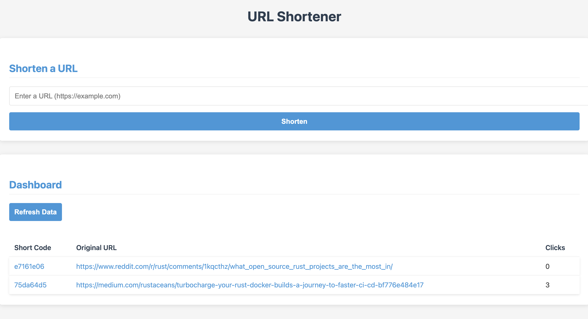

# Rust URL Shortener



A simple URL shortener application built with Rust, Actix Web, and Yew.

## Features

- Shorten URLs with a unique code
- Redirect to the original URL
- Track click counts
- Dashboard to view all shortened URLs and statistics

## Architecture

- **Backend**: Rust with Actix Web framework
- **Frontend**: Rust with Yew framework compiled to WebAssembly
- **Storage**: JSON files for simplicity

## Quick Start

### Prerequisites

- Rust and Cargo (latest stable version)
- [Trunk](https://trunkrs.dev/) for building and serving the WebAssembly frontend
- wasm32-unknown-unknown target: `rustup target add wasm32-unknown-unknown`

### Run with the start script

The simplest way to run the application is to use the provided start script:

```bash
./start.sh
```

This will:
1. Start the backend server on http://localhost:8081
2. Start the frontend server on http://localhost:8080
3. Create necessary directories for data storage

Once running, open http://localhost:8080 in your browser to use the URL shortener.

### Manual Setup

If you prefer to run the servers manually:

#### Backend

```bash
# Create data directory
mkdir -p data

# Run the backend server
cargo run
```

The backend will run on http://localhost:8081.

#### Frontend

```bash
# Navigate to the frontend directory
cd frontend

# Run the Trunk development server
trunk serve
```

The frontend will run on http://localhost:8080.

## Development

### Project Structure

- `/src` - Backend code (Actix Web)
  - `/model` - Data models
  - `/routes` - API routes and handlers
  - `/storage` - Storage functions
- `/frontend` - Frontend code (Yew)
  - `/src` - Rust source files
  - `/public` - Static assets

### API Endpoints

- `POST /shorten` - Create a short URL
- `GET /{code}` - Redirect to the original URL
- `GET /dashboard` - Get statistics about all URLs

## License

MIT 